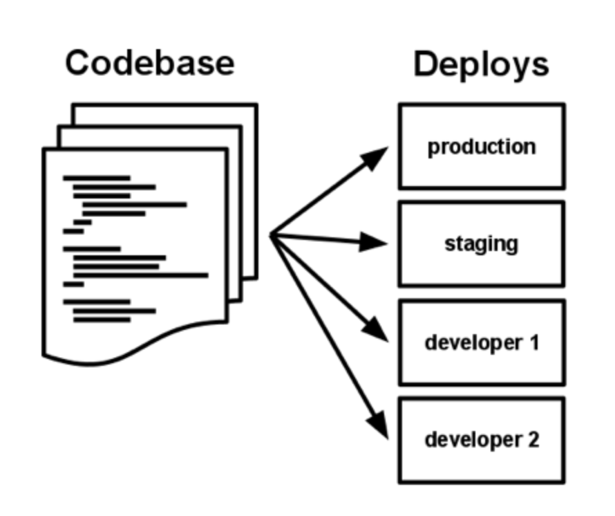

# I. Codebase
One codebase tracked in revision control, many deploys

# II. Dependencies
Explicitly declare and isolate dependencies

- **A twelve-factor app never relies on implicit existence of system-wide packages.**
- It declares all dependencies, completely and exactly, via a dependency declaration manifest. (package.json, Gemfile, pip)
- Furthermore, it uses a dependency isolation tool during execution to ensure that no implicit dependencies (system-wide) “leak in” from the surrounding system.
- Twelve-factor apps also do not rely on the implicit existence of any system tools. Examples include shelling out to ImageMagick or curl. While these tools may exist on many or even most systems, there is no guarantee that they will exist on all systems where the app may run in the future, or whether the version found on a future system will be compatible with the app. If the app needs to shell out to a system tool, that tool should be vendored into the app.

# III. Config
An app’s config is everything that is likely to vary between deploys (staging, production, developer environments, etc).

Apps sometimes store config as constants in the code. This is a violation of twelve-factor, which requires **strict separation of config from code**. Config varies substantially across deploys, code does not.

**The twelve-factor app stores config in environment variables (often shortened to env vars or env).**

# IV. Backing services

A backing service is any service the app consumes over the network as part of its normal operation.

**The code for a twelve-factor app makes no distinction between local and third party services.**
- To the app, both are attached resources, accessed via a URL or other locator/credentials stored in the config. 
- A deploy of the twelve-factor app should be able to swap out a local MySQL database with one managed by a third party (such as Amazon RDS) without any changes to the app’s code.

Each distinct backing service is a resource.

Resources can be attached to and detached from deploys at will.
- For example, if the app’s database is misbehaving due to a hardware issue, the app’s administrator might spin up a new database server restored from a recent backup. The current production database could be detached, and the new database attached – all without any code changes (only the resource handle in the config needs to change).